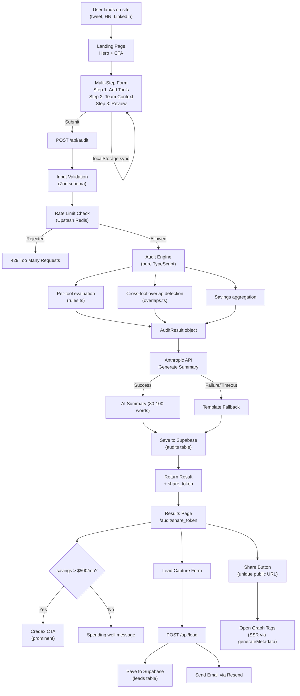

# ARCHITECTURE.md — StackDown System Design

## Overview

StackDown is a server-rendered Next.js application that takes a user's AI tool subscriptions as input, runs them through a deterministic rule-based audit engine, generates a shareable result URL with dynamic Open Graph metadata, and optionally captures a lead and sends a transactional email.

---

## System Diagram



---

## Data Flow: User Input → Audit Result

```
1. USER fills form
   ├── Adds tools one by one (Cursor, Copilot, Claude, etc.)
   ├── For each: selects plan, enters seat count, enters monthly spend
   ├── Enters team size and primary use case
   └── Form state auto-saves to localStorage (debounced 500ms)

2. USER clicks "Get My Audit" → POST /api/audit fires
   ├── Request body validated by Zod schema (reject malformed data)
   ├── Client IP checked against Upstash rate limiter (5 audits/IP/hour)
   └── If rejected: return 429 with friendly message

3. AUDIT ENGINE runs (server-side, pure TypeScript, ~50ms)
   ├── FOR EACH tool in user's stack:
   │   ├── Check: is their plan oversized for their team size?
   │   ├── Check: is there a cheaper plan from same vendor?
   │   ├── Check: can Claude Team 5-seat minimum trap be avoided?
   │   └── Generate: ToolRecommendation with action, savings, reasoning
   ├── CROSS-TOOL OVERLAP scan:
   │   ├── Cursor + Copilot → HIGH severity (functional overlap)
   │   ├── Cursor + Windsurf → HIGH severity (same category)
   │   └── Claude + ChatGPT → MEDIUM severity (context-dependent)
   └── AGGREGATE totals, tier classification, savings percentage

4. ANTHROPIC API call (with 8-second timeout)
   ├── Send audit results + context to Claude Sonnet
   ├── Prompt: CFO persona, 80-100 word paragraph, specific names+numbers
   ├── On success: include AI summary
   └── On failure: generate deterministic template fallback

5. SAVE TO SUPABASE
   ├── Generate share_token (nanoid, URL-safe, 10 chars)
   ├── INSERT into audits table with full JSONB result
   └── Return: { shareToken, result, aiSummary }

6. CLIENT receives result
   ├── Stores in sessionStorage for instant render
   ├── Navigates to /audit/[shareToken]
   └── Results page renders with count-up animation on savings

7. SHARE FLOW
   ├── SSR fetches audit by share_token from Supabase
   ├── generateMetadata returns OG tags with savings figure
   ├── PII stripped from public view
   └── Social previews show: "Save $472/mo on AI tools — Free audit"
```

---

## Database Schema

### `audits` Table
```sql
CREATE TABLE audits (
  id UUID PRIMARY KEY DEFAULT gen_random_uuid(),
  share_token TEXT UNIQUE NOT NULL,
  tools_data JSONB NOT NULL,
  audit_result JSONB NOT NULL,
  ai_summary TEXT,
  team_size INT NOT NULL,
  use_case TEXT NOT NULL,
  total_monthly_savings DECIMAL NOT NULL,
  total_annual_savings DECIMAL NOT NULL,
  savings_tier TEXT NOT NULL,
  ip_hash TEXT,
  created_at TIMESTAMPTZ DEFAULT NOW()
);

CREATE INDEX idx_audits_share_token ON audits(share_token);
CREATE INDEX idx_audits_created_at ON audits(created_at);
```

### `leads` Table
```sql
CREATE TABLE leads (
  id UUID PRIMARY KEY DEFAULT gen_random_uuid(),
  audit_id UUID REFERENCES audits(id) ON DELETE SET NULL,
  email TEXT NOT NULL,
  company_name TEXT,
  role TEXT,
  high_savings BOOLEAN DEFAULT FALSE,
  email_sent BOOLEAN DEFAULT FALSE,
  created_at TIMESTAMPTZ DEFAULT NOW()
);

CREATE INDEX idx_leads_email ON leads(email);
```

### Row Level Security
- `audits`: Public SELECT (share_token is access control), service role INSERT
- `leads`: Service role only (never exposed to client)

---

## Audit Engine Architecture

The engine is a **pure function with no side effects**:

```typescript
runAudit(input: AuditInput): AuditResult
```

It is composed of three layers:
1. **`rules.ts`** — Per-tool evaluation (6 rule categories: plan sizing, overlaps, API vs subscription mismatch, Credex relevance, seat right-sizing, use-case fit)
2. **`overlaps.ts`** — Cross-tool conflict matrix (5 overlap rules with severity and savings calculation)
3. **`index.ts`** — Aggregator that combines both, calculates totals, and classifies the savings tier

**Design rationale:** The engine is deliberately NOT using AI for recommendations. Finance-literate evaluators spot-check reasoning. AI-generated numbers are unreliable. The deterministic approach means every recommendation has a specific, verifiable dollar figure derived from official pricing data.

---

## Stack Justification

| Choice | Alternative Considered | Why This One |
|--------|----------------------|--------------|
| **Next.js** | Vite + React SPA | SSR required for OG tags on share URLs. Crawlers see empty `<div id="root">` with a SPA. |
| **Supabase** | Firebase Firestore | Predictable pricing, SQL familiarity, RLS for lead data security. Firestore charges per read — traffic spikes become surprise bills. |
| **Anthropic API** | OpenAI GPT-4 | Assignment preference. Claude Sonnet writes more natural prose for the CFO persona. |
| **Upstash Redis** | In-memory rate limiting | Serverless functions are stateless. In-memory state resets on every cold start. Upstash persists across invocations. |
| **Resend** | SendGrid / SES | Best developer experience. 3,000 emails/month free. React Email templates work natively. |
| **Tailwind CSS** | MUI / Mantine | Custom aesthetic ("financial terminal × Vercel"). Component libraries impose their design system. We want dark-mode-first, custom tokens. |

---

## Scaling Plan: Handling 10,000 Audits/Day

The current architecture handles this comfortably. Key bottlenecks and mitigations:

### Bottleneck 1: Anthropic API rate limits
**Current:** Synchronous API call blocks the audit response.  
**At 10k/day:** ~7 req/min average, but traffic is bursty. Anthropic's rate limits may throttle peak load.  
**Solution:** Move AI summary generation to an async background job (Supabase Edge Functions or Vercel Cron). Return the audit result immediately, update the summary column asynchronously. The client polls or uses Supabase Realtime to receive the summary when ready.

### Bottleneck 2: Supabase connection limits
**Current:** Each API route creates a new Supabase client (serverless — no persistent connections).  
**At 10k/day:** ~7 req/min is well within Supabase's free tier (50 concurrent connections).  
**Solution at 100k/day:** Add Supabase connection pooling (PgBouncer, already available in Supabase dashboard). Or migrate writes to a queue (e.g., Inngest) to flatten spikes.

### Bottleneck 3: Rate limiter redis load
**At 10k/day:** 10k Redis ops/day — well within Upstash free tier (10k/day).  
**At scale:** Upgrade to Upstash Pro ($10/mo) for 1M ops/day.

### Bottleneck 4: Vercel Edge Function limits
**Current:** Next.js API routes run as Node.js serverless functions (512MB memory, 30s timeout).  
**At scale:** The audit engine is fast (~50ms). No timeout issues. Move rate-limiting to Vercel Edge Middleware for lower latency.
