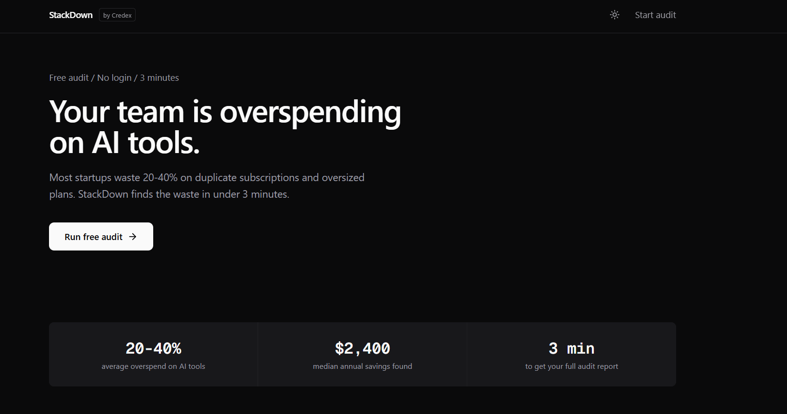
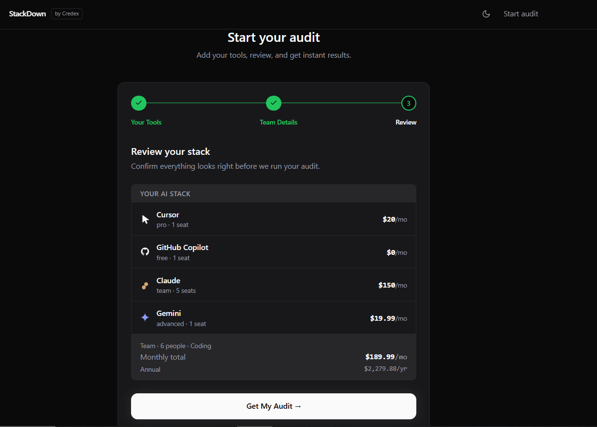
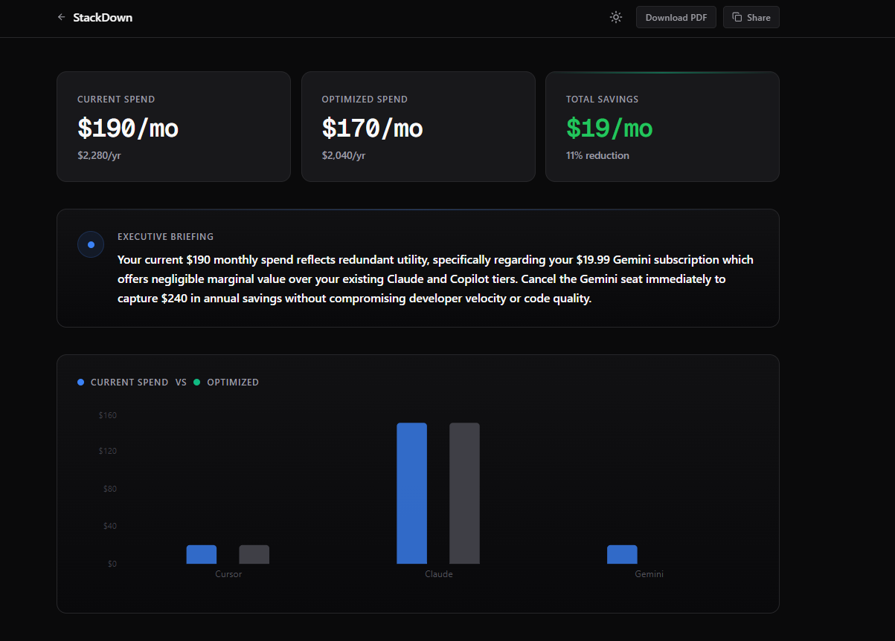
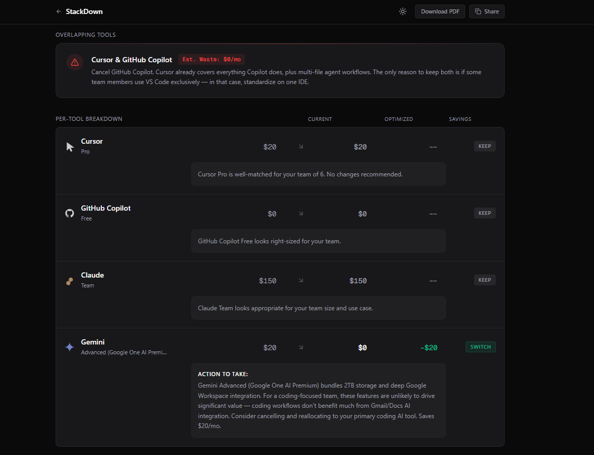

# StackDown — AI Spend Audit Tool

> Stop overpaying for AI tools. Get your free audit in 3 minutes.

StackDown analyzes your team's AI tool subscriptions, identifies overlap and oversized plans, and shows you **exactly how much you can save** — with specific reasoning for every recommendation.

Built as a lead-generation tool for [Credex](https://credex.rocks), which helps startups access discounted AI infrastructure credits.

---

## Screenshots





---

## Features

- **Multi-step audit form** — Add up to 8 AI tools, configure plans, seats, and actual spend. Form state persists across reloads via localStorage.
- **Deterministic audit engine** — Rule-based logic (no AI guesswork) evaluates each tool for plan right-sizing, cross-tool overlap, and seat waste. Every recommendation includes a specific dollar figure and defensible reasoning.
- **AI-generated executive summary** — Claude Sonnet generates a personalized 80-100 word paragraph acting as a "fractional CFO" briefing. Falls back to a template if the API is unavailable.
- **Shareable audit URL** — Every audit gets a unique public link (`/audit/<token>`). PII is stripped from public views. Open Graph tags are dynamically generated for social previews.
- **Lead capture + email** — Users can optionally receive their report via email. Leads are stored in Supabase. Resend sends a rich HTML email with a direct link back to the audit.
- **PDF export** — One-click `window.print()` with a polished print stylesheet. No library needed.

---

## Quick Start

### Prerequisites
- Node.js 20+
- npm 9+

### Install

```bash
git clone https://github.com/your-username/spendlens.git
cd spendlens
npm install
cp .env.example .env.local
# Fill in your API keys in .env.local
```

### Run locally

```bash
npm run dev
# Open http://localhost:3000
```

### Run tests

```bash
npm test
```

### Deploy

This project is deployed on Vercel. Every push to `main` auto-deploys.

**Deployed URL:** `https://stackdown.vercel.app`

---

## Environment Variables

Copy `.env.example` to `.env.local` and fill in:

| Variable | Description |
|----------|-------------|
| `NEXT_PUBLIC_SUPABASE_URL` | Your Supabase project URL |
| `NEXT_PUBLIC_SUPABASE_ANON_KEY` | Supabase anon/public key |
| `SUPABASE_SERVICE_ROLE_KEY` | Service role key (server-side only) |
| `ANTHROPIC_API_KEY` | Anthropic API key for AI summaries |
| `RESEND_API_KEY` | Resend API key for transactional email |
| `UPSTASH_REDIS_REST_URL` | Upstash Redis URL for rate limiting |
| `UPSTASH_REDIS_REST_TOKEN` | Upstash Redis token |
| `NEXT_PUBLIC_APP_URL` | App base URL (e.g. `http://localhost:3000`) |

All integrations degrade gracefully if keys are missing — the app works in a "mock" mode without external services.

---

## Architecture Decisions

### 1. Next.js over a Vite SPA
Shareable audit URLs (`/audit/abc123`) need server-side rendering for Open Graph meta tags. A pure SPA returns `<div id="root">` to crawlers — Twitter cards, Slack previews, and LinkedIn embeds would all be blank. Next.js App Router handles this with `generateMetadata()` natively.

### 2. Deterministic audit engine — no AI for the core logic
The assignment specifically tests whether you know when NOT to use AI. The audit math must be defensible by a finance-literate person. AI-generated pricing recommendations would be unreliable and unauditable. The engine is pure TypeScript with typed inputs/outputs, and every recommendation cites specific plan names and dollar figures. AI is reserved for the executive summary paragraph — where prose quality matters more than precision.

### 3. Supabase over Firebase
Predictable pricing (Firestore charges per document read — a Product Hunt spike could generate surprise bills). SQL is more auditable than Firestore's document model. Row-Level Security ensures lead data is never exposed to client-side code.

### 4. Upstash Redis for rate limiting over in-memory state
In-memory rate limiting doesn't survive serverless cold starts. Upstash Redis persists across function invocations and is free at our traffic scale. Sliding window of 5 audits per IP per hour.

### 5. Email captured after value, never before
The tool shows the complete audit result without requiring any login or email. The lead capture form appears at the bottom of the results page, *after* the user has already seen their savings. This builds trust and meaningfully increases conversion compared to gating results.

---

## Tech Stack

| Layer | Technology |
|-------|-----------|
| Framework | Next.js 15 (App Router) + TypeScript |
| Styling | Tailwind CSS v4 + custom design tokens |
| Components | shadcn/ui (unstyled, copy-pasted into project) |
| Animations | Framer Motion (minimal — 3 uses) |
| Database | Supabase (PostgreSQL + RLS) |
| Email | Resend |
| AI | Anthropic Claude Sonnet (summary only) |
| Rate Limiting | Upstash Redis |
| Deployment | Vercel |
| Testing | Vitest |

---

## Project Structure

```
├── app/
│   ├── api/
│   │   ├── audit/          # POST /api/audit — runs the engine
│   │   ├── audit/[token]/  # GET /api/audit/:token — fetches saved audit
│   │   └── lead/           # POST /api/lead — captures email, sends report
│   ├── audit/[token]/      # Results page (SSR for OG tags)
│   └── page.tsx            # Landing page
├── components/
│   ├── form/               # Multi-step audit form components
│   └── ui/                 # Shared UI components (tool logos, etc.)
├── lib/
│   ├── audit-engine/       # Core business logic (pure TS, no side effects)
│   ├── anthropic.ts        # AI summary generation with fallback
│   ├── ratelimit.ts        # Upstash rate limiter config
│   └── supabase/           # Supabase client instances
├── __tests__/              # Vitest test files
└── public/
    └── logos/              # SVG logos for AI tools
```
